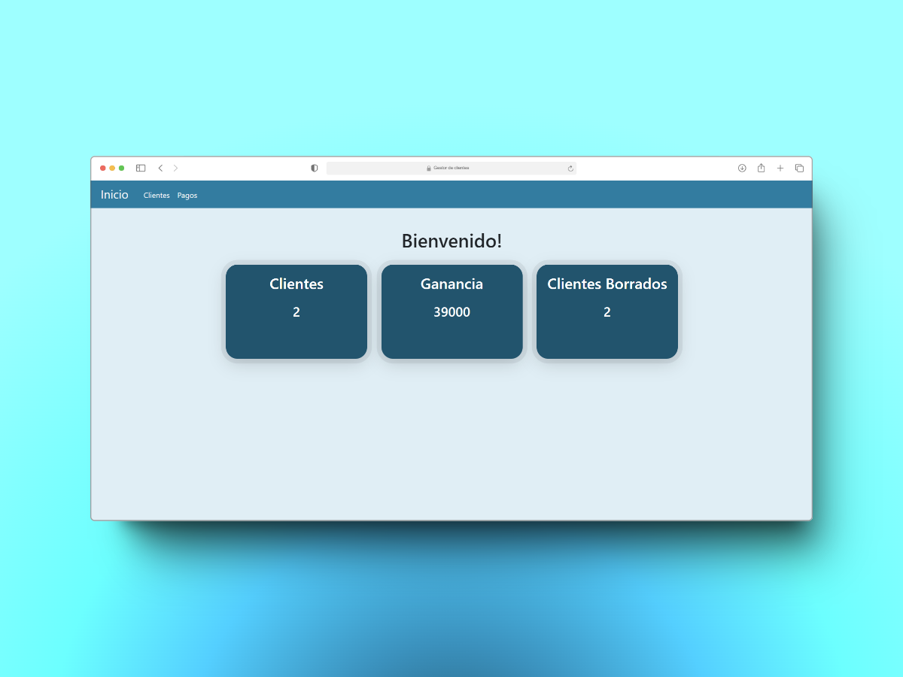
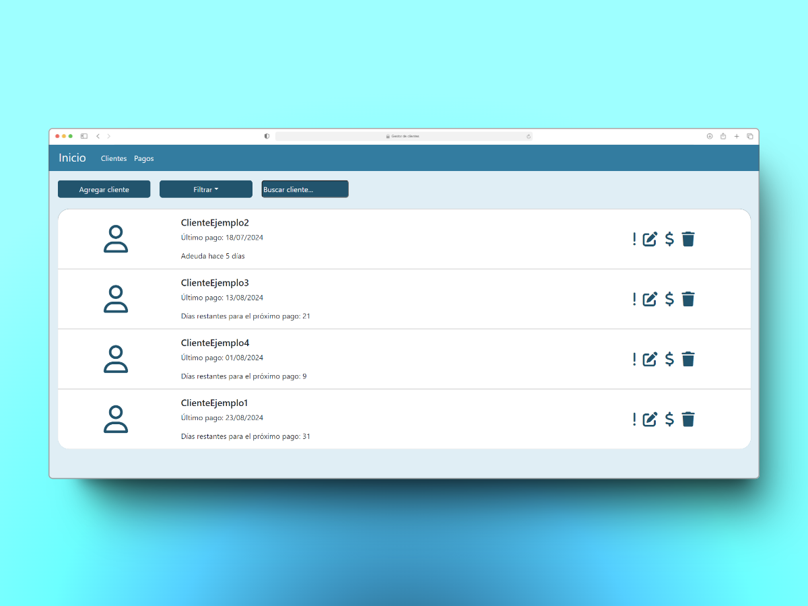
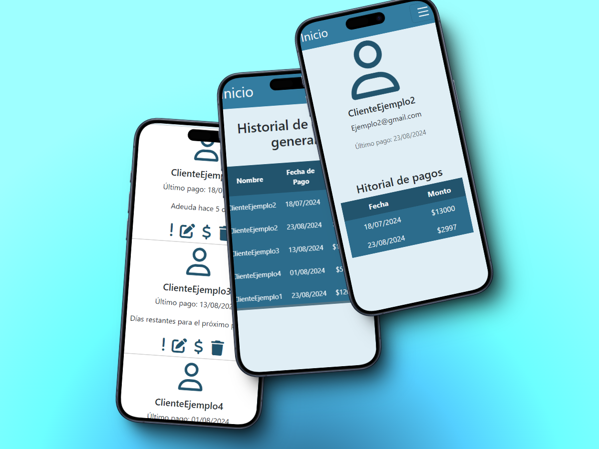

# 👤⚛️ Gestor De Clientes
¡Bienvenido/a al repositorio de mi gestor de clientes!

## 📦 Descripción del Proyecto
He creado un gestor de clientes utilizando ReactJS y Vite, siguiendo buenas prácticas de desarrollo y aprovechando librerías como Luxon, React Router DOM y React Loading Skeleton. Este proyecto permite gestionar información de clientes de manera eficiente.

## 🔨 Funcionalidades del proyecto
- `Obtención de datos desde base de datos (Firebase - Firestore)`: Implementación de la integración con Firebase-Firestore para recuperar los datos de clientes y renderizarlos en la aplicación.

- `Creación, eliminación y modificación de datos de clientes`: Desarrollo de funcionalidades para agregar nuevos clientes, eliminar los existentes y modificar la información de los clientes en la base de datos.

- `Gestión de pagos de clientes`: Implementación de la capacidad para agregar, editar y visualizar los pagos de los clientes.

- `Filtrado de clientes según su pago`: Creación de un sistema de filtrado que permite ver solo los clientes que cumplen con ciertos criterios de pago.

- `Visualización de pagos generales y métricas de clientes`: Inclusión de una sección para visualizar todos los pagos registrados, junto con métricas relevantes sobre la base de clientes, como estadísticas de crecimiento o ingresos mensuales.

## 🛠️ Herramientas principales

## 📸 Imagenes del proyecto

## ❔Donde puedo ver el proyecto? 
Puedes ver el proyecto en: [Gestor De Clientes](https://gestor-de-clientes.vercel.app/).